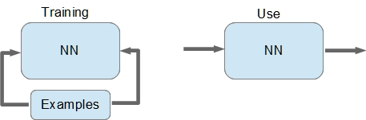
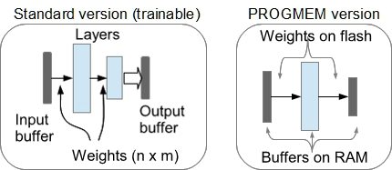
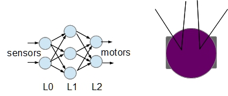

# Neural Networks for Arduino (and for others micros)
This repository contains a library for simple Neural Network (NN for short). The library is geared toward simple feedforward 2 layer NN. 

NNlib has the ambition to make NN work on such reduced hardware as Arduino Uno. NNlib exists in two versions V3.0 and V2.5. First version V3.0 is more complete and it is planed for a wide range of hardware: from Arduino to PC. Second version V2.5 is calibrated particularly  for reduced hardware. This version is simplified but is slower because RAM optimization.
Both versions can run using PROGMEM structure for a previously trained NN. In this case only buffers for input, hidden nodes and output need to be automatically created because connection weights are in flash memory(V2.5 allocates just input an output buffers). Using this solution, even Arduino Uno can be used for a NN relatively large (for example: 256 input, 100 hidden, 10 out).

What is a Neural Network? There are many types of NN ; this library implements the feed-forward NN. A feed-forward NN can be seen as black-box that can be trained by examples.




A NN can be trained: to simulate any function (multidimensional) (in theory), to extract statistical behaviour, to categorize and so on. The sole training, by a big series of examples, is that you need. Of course, the chosen structure of NN can do training, more or less efficient. NNlib allows to define a feed-forward NN with two layer + input buffer. Dimension of input, hidden (intermediate) and output defines the NN behaviour.



The library contains some examples of application. Also the well-known MNIST test is provided, but just for using on hardware environment with enough memory. The library is coded in C++. There are just two source files: **NNet.h** and **NNet.cpp** . You can use library moving it on Arduino IDE library folder, or you can use in another hardware/IDE compiling the library with your program.  If you use this library on different environment you have just to comment the “define” line about Arduino environment.
A detailed help is provided. 

------

#### Example of use NNlib on ARDUINO

NN for driving a robot with 2 sensor and 2 motors.



```
const PROGMEM struct      // network definition in flash 
{
 int dimin=2;             // dimension of input buffer (L0)
 int dimhi=3;             // dimension of hidden buffer(L1)
 int dimou=2;             // dimension of output layer (L2)
 int fun1=2;              // activation function type (2=tanh) for hidden layer (L1)
 int fun2=2;              // activation function type (2=tanh) for otput layer (L2)
  float wgt10[3][2]=
  {                       // weights value from layer0 to layer1 (to 1 from 0)
   {-1.7421, 1.8831},
   {-1.2655, -1.2739},
   {5.5744, 5.5538}
  };
  float wgt21[2][3]=
  {                        // weights value from layer1 to layer2 (to 2 from 1)
   {-1.0792, 2.8989, 2.8752},
   {1.0836, 3.2336, 2.9449}
  };
 }pnet;
 
/* in setup() */
 ...
pgm=NNet::initNetPROGMEM(&pnet,false,false);

/* in loop() */
...
inp[0]=...                      // read sensor left
inp[1]=...                      // read sensor right
NNet::forwPROGMEM(pgm,inp,out); // net computing
motorL(out[0])                  // acting motor left
motorR(out[1])                  // acting motor right

```

> [NNlib4PC](NNlib4PC) contains library version ready for environments different from ARDUINO like Windows, Raspberry Pi etc. Library has the same function but the function specialized for ARDUINO are disabled and vice versa. The directory contains a environment for MNIST training and test with a simple NN, in addition.