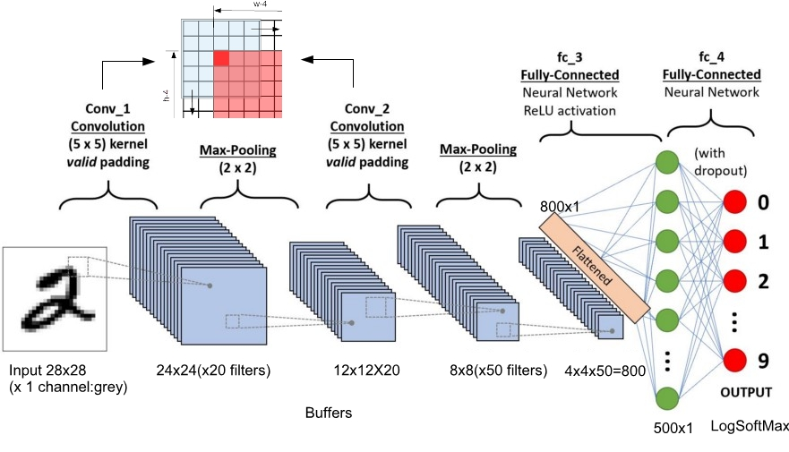
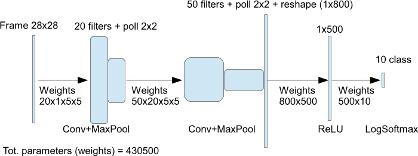

### Deep Learning NN for MNIST task and Jetson Nano

The **MNIST database** (Modified [National Institute of Standards and Technology](https://en.wikipedia.org/wiki/National_Institute_of_Standards_and_Technology) database) is a large database of handwritten digits that is commonly used for training various image processing systems (see [here](http://yann.lecun.com/exdb/mnist/) for details). It is a sort of "*helloworld*" for AI, and can be used for comparison between image processing systems efficiency.

The network structure is included in Jetson Nano system software (JetPack), more precisely in examples about Python-TensorRT  ("/usr/src/tensorrt/samples/python/network_api_pytorch_mnist") or downloaded from  [here](https://github.com/mkolod/tensorrt_python_samples/tree/master/samples/python/network_api_pytorch_mnist). These examples are provided for testing translation from PyThorch model to TensorRT model. TensorRT is a deep learning framework library specialized in implementing inference NN models on CUDA hardware. The example proposed by NVIDIA has been modified and increased to show the procedure to tranform a PyTorch model to a TensorRT model and to use it on Jetson Nano (CUDA engine) , in details. But this example it is also used to describe a relatively simple deep learning architecture.





```
# Network
class Net(nn.Module):
    def __init__(self):
        super(Net, self).__init__()
        self.conv1 = nn.Conv2d(1, 20, kernel_size=5)
        self.conv2 = nn.Conv2d(20, 50, kernel_size=5)
        self.conv2_drop = nn.Dropout2d()
        self.fc1 = nn.Linear(800, 500)
        self.fc2 = nn.Linear(500, 10)

    def forward(self, x):
        x = F.max_pool2d(self.conv1(x), kernel_size=2, stride=2)
        x = F.max_pool2d(self.conv2(x), kernel_size=2, stride=2)
        x = x.view(-1, 800)
        x = F.relu(self.fc1(x))
        x = self.fc2(xP)
        return F.log_softmax(x, dim=1)
```

#### Scripts:

- MNISTmodel.py : just a library used by other scripts
- MNISTdsource.py : just a library used by other scripts 
- **TrainMNIST.py** : train the network using samples included in directory <code>data</code>
- **InferenceMNIST.py** : inference test speed using 10000 test samples included in directory <code>data</code> Inference uses trained network <code>NetMNIST.pth </code>
- **GraphMNIST.py** : GUI program to test inference (you can also draw your own digit)(it needs PyQt5 library installed in Python)
- **MNISTshowFeat.py** : GUI program to show result of first layer of filter
- **InfMNISTcudaRT.py** : inference test speed using <code>NetMNIST.rt</code> trained net in TensorRT format (it needs CUDA)

#### Some result:

Data are loaded with batch size of 64 samples at time, for default. This means that in training phase weights are trimmed using a cumulated gradient. In any case, also inference phase is conditioned by this batch loading of data. 

**Training** 

Windows 10 with Intel I7 and 16MB : 
5 epochs (of 60000 samples each) -> 98.9%  precision 
Time spent: 323 sec. (about 5.3 minutes)

**Inference** (10000 data)

Windows : batch size 64 = 4.9 sec. 
                    batch size 1 = 13.5 sec.

Jetson Nano (cpu) : batch size 64 = 34 sec.
                                   batch size 1 = 104 sec.

Jetson Nano (CUDA) : batch size 64 = 20 sec.
                                       batch size 1 = 81 sec.

Jetson Nano (TensorRT on CUDA) : batch size 1 = 50 sec. (TensorRT doesn't accept more than 1 sample at time, for present version)


