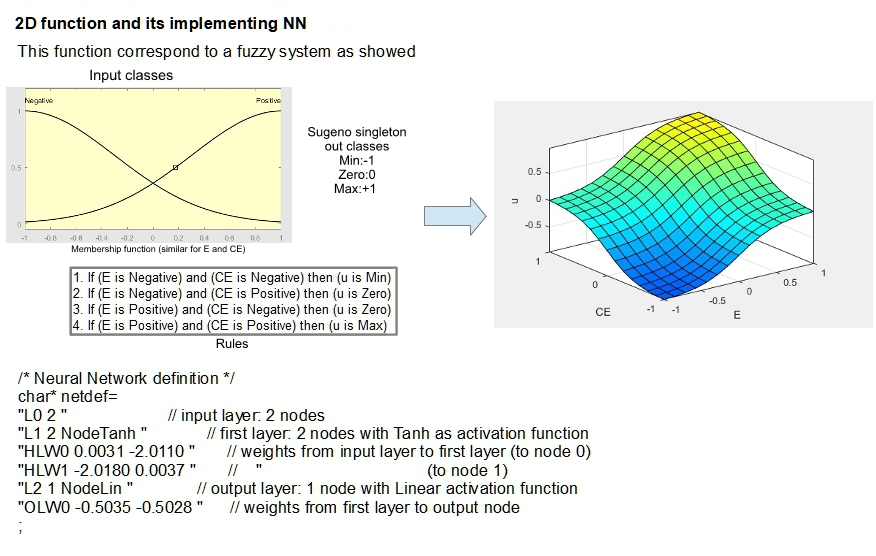

## Tracking using HAARCascade

OpenCV library is a sophisticated functions container for images processing. Can be used with C++ language, Java or Python and can utilize CUDA accelerator if present. Unfortunately compiled version for Jetson Nano doesn't consider CUDA structure. So, it needs a complete compilation task. This task requires some hours. For this reason, a complete system image for Jetson Nano is provided in this repository. You can download this OS image and put it on a SD card.

OpenCV library includes a object detection using a HaarCascade method. This method is simpler than deep-learning convolution method but it is lighter and faster. More details can be found in 

https://docs.opencv.org/4.5.1/db/d28/tutorial_cascade_classifier.html

OpenCV version used in this example : OpenCV 4.5

The python script "ObjectDetectHaar.py" uses this method and can be used in a environment with CUDA or without CUDA (PC, Raspberry Pi or Jetson NANO).

```
usage: ObjectDetectHaar.py [-h] [-?] [-cuda] [-windowdim WINDOWDIM] [-file FILE] [-camnum CAMNUM] [-react REACT] [-serial SERIAL] [-trace] [-nowin] [-winsel]
```

Each detecting event can activate a thread for serial communication of object center to a controller, for camera pan-tilt. Another separate thread is started for small squared sub-image extraction. This sub-image contains object detected, and can be used for further object recognition function.

Default file parameter is "haarcascade_frontalface_default.xml". This haar structure has been trained for face detection, but can be substitute with other object detection haar file. Unfortunately only old version of these files (included in "haarcascades_cuda" directory) are CUDA compatible.

 Performance

PC core i7 mem 16G  no CUDA:	about 20 frame/sec
Jetson NANO  no CUDA: 				about 6.5 frame/sec
Jetson NANO   CUDA:					  about 7.5 frame/sec
Raspberry Pi 3 :								about 1.8 frame/sec

OpenCV haarcascade library has not a good implementation on CUDA hardware (cancelled in previous versions and now reactivate ). For this reason this example has not so better performance with CUDA, than with only CPU used. (N.B. OpenCV compiled with CUDA but also with multithread option, on Jetson NANO)

**Controller for pan-tilt**

In addition to detect object (just the first one in the frame), this script uses a separate thread to send center of object and dimension of its framework by serial port (at 57600 baud) to a optional camera pan-tilt controller. In the sub-directory "Arduino" is showed an example of controller realized with Arduino and a couple of server. The Arduino script doesn't implement a PID controller and uses a Fuzzy controller approach instead. 

The Fuzzy controller is simulated by a Neural Network that implement a two dimension not linear function. One input is the error E and the other one is the variation of error CE

 

