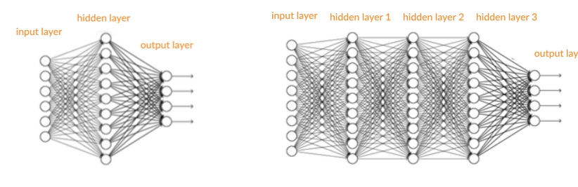
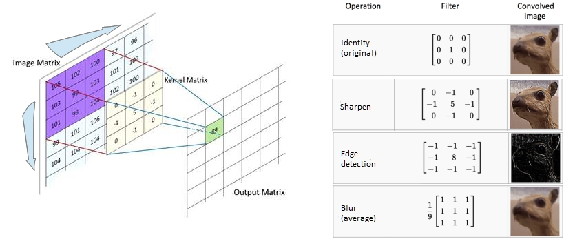
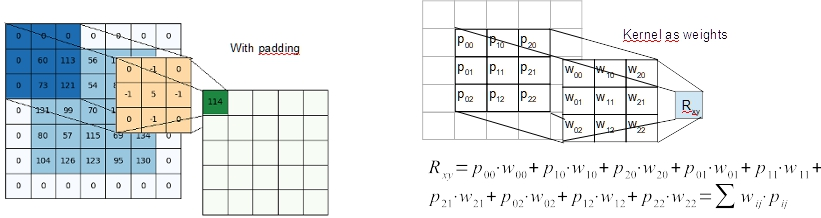
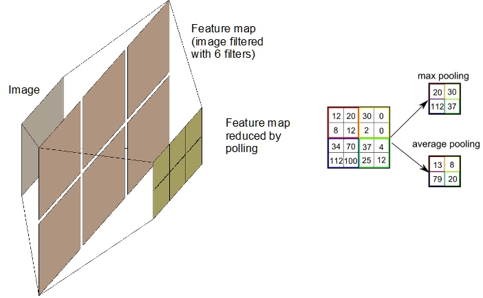
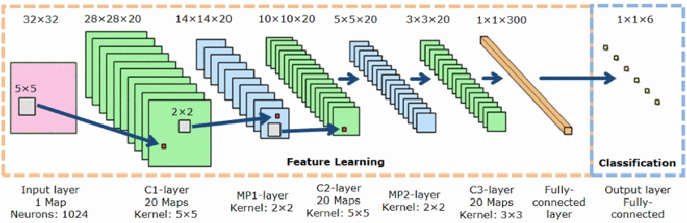

### Convolution Neural Network for Images 

This branch is dedicated to more sophisticated NN architecture than simple feed-forward NN.

Convolution NN is one of these complex structure that has recently a exciting deployment  and a promising future.

Adding full connected layers to a classical feed-forward NN **simply doesn't work**. For complex tasks multiple full connected layers have serious problems to converge to the best solution in the training phase. Because the non linear activation function used, the the gradient descent learning method becomes useless after few layer back-propagation steps. Gradient becomes zero or huge. Result: very trivial local minimum of loss function or instability and weights explosion. 

The solution was found allowing the NN to learn how filter imagine by its self. Filtering imagine means applying  a convolution of a little kernel (3x3 or 5x5 typically) on the image. 

#### Image convolution filter

A convolution filter consists in a linear combination of near pixels. The weights of this combination are called kernel and its values define the filter behavior. The kernel is moved to scan the whole image.

[Here you can see some image kernel examples](https://aishack.in/tutorials/image-convolution-examples/)

Convolution can be seen as weighted sum as it occur in the nodes of NN. So it can be learned using the classical gradient descent method. But in this case the same kernel is glided on whole image and the gradient is summarized.

Usually many kernel filters are provided for acting in parallel, so, from an image we have a lot of image filtered as result. To reduce the huge amount of parameters a polling procedure it is applied.

Despite using polling, because the use of several filters (generally more than 6), and because more layers are usually stacked up, parameters of convolutional NN can by really huge. But convolution layers are not the whole network. Actually, convolution layers have to be finalized using a classical feed-forward layer for linking preprocessing to result. Usually this is a classification task. In this case a soft-max function is applied to the last layer. 

Consider also that imagine is generally colored, so filters have to work for each of the 3 color channel. The preprocessing of image is therefore multiplied for 3 parallel way. In any case the learning process is always performed by gradient descent algorithm. NN deep learning libraries have to concern about tracking this gradient in such a complex structure. Usually training is performed in terms of **batch** evaluation. It means that examples are processed in a sequence of tents or hundreds  of them. The gradient is added up in each node and finally used for weights adjusting. For this reason input buffer is often able to record several examples. For instance, a shape of (64, 3, 32, 32) could mean that input buffer contains 64 samples of 3 channel of a image 32 x 32 pixels. Layers weights have multidimensional shape too. The same applies for output buffer.  Substantially, representation of layer and buffers  is made by multidimensional  matrix called tensors.