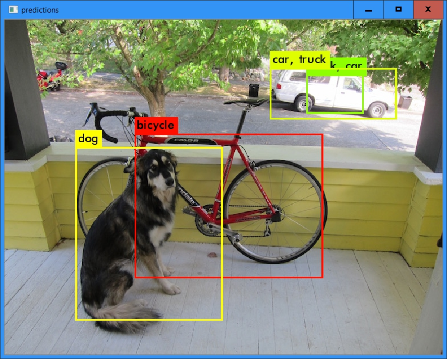
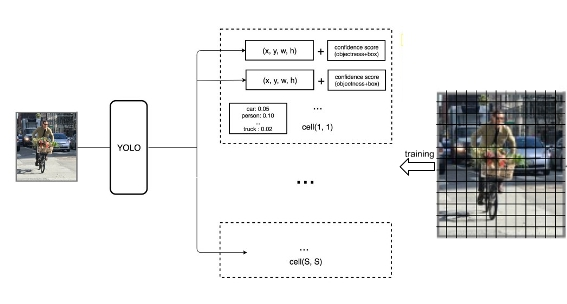
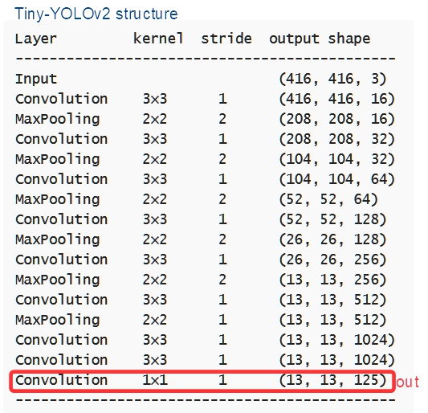

### Darknet and YOLO

This repository contains experiments of using Darknet and YOLO on **Raspberry Pi** and on WINDOWS for testing Raspberry Pi performance in a ***object detection*** task. 

Darknet is a framework in C++ language that has been used especially for implementing, training and deploying YOLO network structure, even if it can be used for any NN structure in theory. Unfortunately this interesting framework  is not described in a exhaustive way. People substantially need the source software examination to understand and use Darknet. Particularly the file “darknet.c” contains useful information about the framework structure. Darknet software is described [here](https://pjreddie.com/darknet/) (Darknet author site).

YOLO is a efficient deep learning architecture for object detection task. Object detection is a sub-task of the more general image recognition and classification problem.  In this case the target is to recognize some typical object in a photo or in a video stream (like  camera); for example to identify person, dog, car and so on. 

Because the C++ implementation, YOLO on Darknet can be more efficient on hardware in comparison with other complex deep learning framework. So, it is useful to investigate about the real chance of using deep learning  application on Raspberry Pi.

**Object detection** is a more complex task then the image/object recognition. In this last case, the NN has to classify a image representing a single subject. Substantially the NN contains a sequence of CNN followed by a final classification layers block. Objects detection, instead, must identifier several subjects in the same frame and must locate them inside the frame. In other words NN has to define: class of object, center of object, dimensions of external rectangle and confidence degree; for several objects in the frame. The first approach utilized was a frame scanner procedure. By a sliding window, the entire frame is analyzed forwarding the detection throw different convolution layers. After that some regions are selected as interesting regions and utilized for classification. For this reason this process is really time consuming and difficult to optimize. R-CNN and R-FCN are examples of this initial effort. But thereafter, new *single shot* methods as SSD or YOLO have reduced time significantly. 

**YOLO** (You Only Look Once) network, consists in determining the location on the image where certain objects are present, as well as classifying those objects and does it all with a single neural network. This single neural network is modelled by a sequence of convolution layers (CNN). Starting with a frame of 416x416 pixel and 3 color channels, several filters are applied up to the last CNN layer, where the 13x13x125 output represents the possible presence of a object with its parameters (center, box dimension etc.). The YOLO peculiarity is that the 13x13 matrix represents a grid of regions specialized in containing parameters of 5 objects (maximum) eventually detected inside. So the last layer is not a filter but a classification instead.

More precisely, each region (cell) contains (for each 5 objects):

-  x, y, width, height for the bounding box’s rectangle
-  the confidence score
-  the probability distribution over the 20 classes (in case of VOC datasets: person, bicycle, dog ... )

First version YOLOv1 had 7x7 output regions. Version YOLOv2 has 13x13 regions and the last version YOLOv3 has 56x56 regions for detecting smaller objects and 8 objects for each region. But because the huge dimension of parameters (about 250MB), reduced version has been produced and called Tiny-YOLO (about 35MB). This version is less accurate but lighter and faster.

Some complex dataset are used to train object detection deep learning systems. For example, VOC dataset contains picture of 20 classes (see [here](http://host.robots.ox.ac.uk/pascal/VOC/) ), and COCO dataset 80 classes (see [here](https://cocodataset.org/#home) ). In any case each picture has a correspondent list of information about objects inside (as object class, container box coordinates,  etc.).

#### Test on WINDOWS

The archive **DarkNetWinNoGpu.zip** contains software for Windows environment (without CUDA gpu available). This software includes the program "darknet.exe" with required libraries,  YOLO network configurations and commands. OpenCV has to be previously installed (for webcam management).The network uses weights trained with VOC classes, or COCO classes. To use test you have to download and decompress the directory and download weights pre-trained. (Downloading weights is separate because their big dimension.) In this package there are two batch commands: 

- TestCam-tiny2-Win.cmd , starts detecting objects on frames from webcam stream. It uses tiny version of YOLOv2 and 20 VOC classes. It imagines to find and load weights "*yolov2-tiny-voc.weights*" in the same directory.
- TestCam-tiny3-Win.cmd, starts test using tiny version of  YOLOv3. It uses weights "*yolov3-tiny.weights*" and COCO 80 classes.

Performance on W10 with i7 and 16Mb memory (no CUDA):  about **3 frame/sec**

#### Test on Raspberry Pi 3

The direct use of Tiny-YOLO on Raspberry Pi 3 causes a unacceptable performance of 0.2 frame/sec. For this reason we search for a software accelerator. **NNPACK** (see [here](https://github.com/Maratyszcza/NNPACK) ) is a software that optimize tensors operations. 

The archive **DarkNetRasp.zip** contains software for Raspberry Pi environment. To uses NNPACK version you have to install NNPACK software included in the archive. Use "Readme.TXT" file for instructions. After that you can use directory "darknet-nnpack", where you have to download the weights (see previous paragraph), and where you can find these commands:

- TestCam-tiny2-Rasp.sh
- TestCam-tiny3-Rasp.sh

Performance on Raspberry Pi 3 with NNPACK version of Tiny-YOLO : about **1frame/sec**

  

