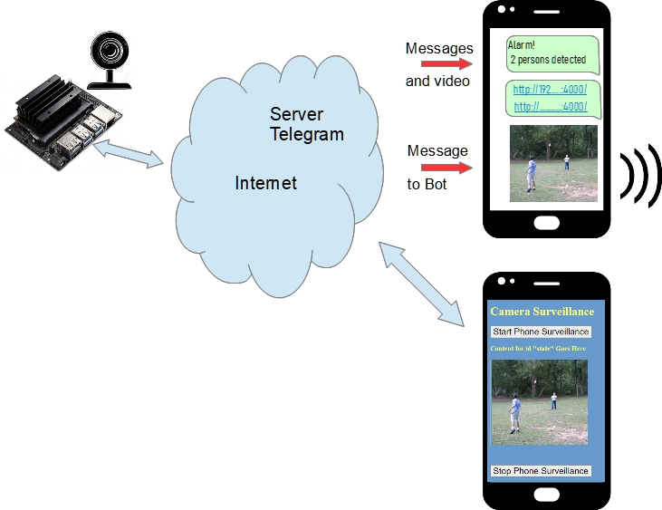
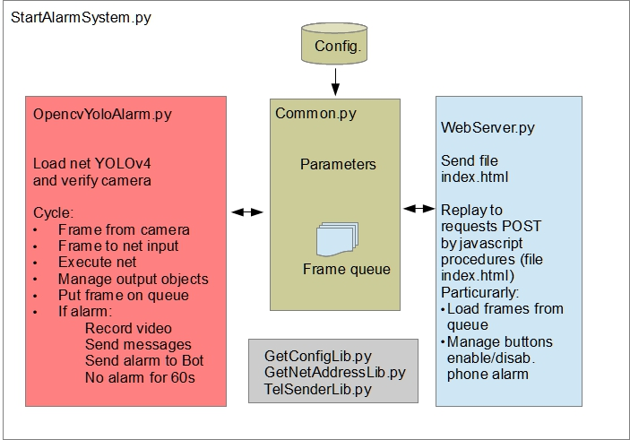

### Camera surveillance and alarm on intruders detection 

This is a complete application designed for Jetson. It uses Python and OpenCv to manage Yolo structure (Yolov4 or Yolov4-tiny). The application uses a web camera USB or the Raspberry Pi camera (but only if it uses IMX2190 chip). Internet link can be made by wire or by Wi-Fi using Jetsons wi-fi extension or using a simple USB wi-fi adaptor (for example with N8508GS device).

Alarm occurs when a 'person' object is detected.

You can change this behavior using different COCO class (for example "bear" for photo trap)

The application send messages to a Telegram user when alarm is detected. The application acts as a signed Telegram user, sending messages to himself. So, it needs some codes asked to Telegram site.

- User has to open a Telegram account (if not yet present)
- User has to ask to https://my.telegram.org/  for an application-id and a application-hash code that application uses to simulate a client and send messages.
- User has to create a Bot using BotFather on Telegram. Bot is needed to alarm with a sound on phone.
  Bot too needs name and code to be included in application.
- Application uses Python Telethon library for simplifying Telegram management.

A Bot script for smartphone Android is included in PhoneScript directory. For installing this script you can use a Android terminal emulator as Termux and install Python on Android and telethon library, previously.

In addition to phone alarm, a simple web-server is implemented. Its addresses (local and public) are sent as phone message. Obviously, for public address connection, port (4000) forward has to be set on router.

A configuration file "**alarmsystem.cfg**" has to be customized (particularly for telegram codes)
Please note that yolo4.wgt  in darknet directory is split in 10 zip files (because big dimension). So you have to put it back together before use application.

