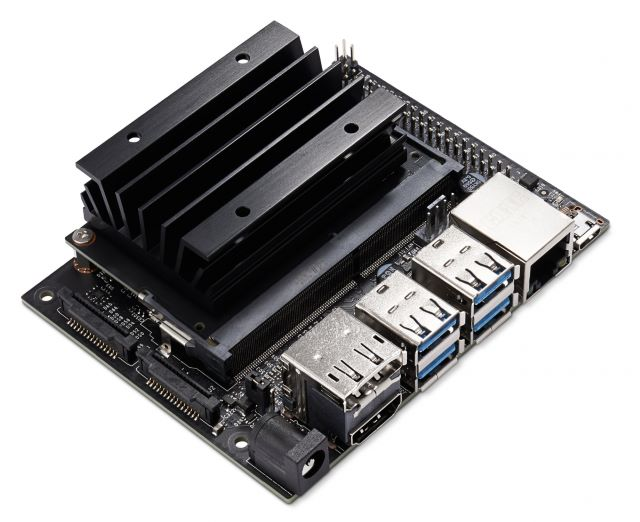

### Jetson NANO software

NVIDIA® **Jetson Nano**™ is a small powerful computer in single board. Can be used for embedded application but it also sold in a **Developer Kit** version, as a stand alone computer. This kit is similar to the Raspberry Pi® in terms of dimension and connections, but it is focused on Neural Networks and numbers crunching, because it has a **CUDA** section included.

Hardware:

- CPU Quad-core ARM® Cortex®-A57 (clock 1.5 Ghz)
- GPU NVIDIA Maxwell™ con 128 core NVIDIA CUDA®
- RAM 4 GB (version with 2 GB available)
- Connectors: HDMI, Display Port,  4 USB3, Gigabit Ethernet, (ready for Wi-Fi expansion), micro SD 
- Expansion header (40 pins) compatible with Raspberry Pi header (but low current)
- Power supply by Power Jack (to 4A) (or by micro-usb but to 2A)

Software:

Use a OS image on SD card. System can start automatically when power supply go on (or you can use a switch if jump J40 is closed (see details on site NVIDIA)).

The OS image can be downloaded from:   

The OS is based on Linux (Ubuntu) and contain also specific software for Jetson Nano hardware:

• NVIDIA Jetson Driver Package (L4T)
• NVIDIA TensorRT (a Deep learning framework)
• cuDNN : CUDA NN library
• CUDA toolkit 
• VisionWorks : computer vision library
• NVIDIA driver OpenGL.
• Multimedia API

**Preconfigured image for downloading** (BckJP441-32G.zip)

Unfortunately, OpenCV pre-installed is non compatible with CUDA, and several useful software and developer environments are not included. For this reason,  it is here available a preconfigured image (but in Italian version) (for Developer Kit with 4 GB RAM), based on JetPack  4.4.1, that contains:

- OpenCV compiled with CUDA and multi processor extension. (Compilation process requires some hours )
- CodeBlocks  (IDE for C++ developing) and PyCharm (IDE for Python developing)
- Some Python libraries (numpy, pillow, matplotlib, PyQt5 etc.)
- PyThorch (another machine learn framework)  and PyCuda (Direct CUDA management with Python)

You can download zipped image and use  BalenaEtcher software (on PC) to write SD card (you can use compressed file directly or unzip image). This image requires a 32 GB SD card at least.

You can use a remote access by SSH (for example with MobaXterm or similar software).

User: jetson , Password: jetson

Some command scripts are included in /home/jetson/bin directory and you can see the list using "commands" command.

A directory "cprog"  containing some C examples is present  ,  as well as a directory "PycharmProg" containing some python programs.

