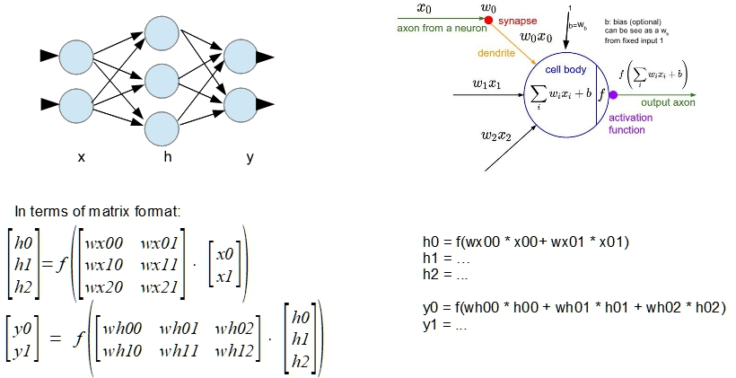

## Artificial Intelligence for experimenter and hobbyist

 

- [NN on Arduino](Arduino/README.md)
- [Deep Learning](Deep_Learning/README.md)

------

#### Introduction 

This repository contains software and information (as simple as possible) for understanding and using Artificial Intelligence methods, and particularly Neural Network, in hobbyist projects. Neural Networks have become ubiquitous in electronics devices in the last decades, also in case of using  its more complex developments, called Deep Learning. The reason of that massive use is consequence of good results with Deep Learning structures, but also for the incredible increase of computing power for downscaled hardware.

#### The Neural Networks (NN) fundamentals

NN software is complete different from classical programming software. NN is a branch of more general Machine Learning domain. Machine Learning means :  **learning algorithms – not computer programmers – create the rules**. In other words, the software is self-organizing to reach the desired functionality. 

To summarize:

- Classic programming : understand the process and program a algorithm to realize desired functionality
- NN approach : train NN with samples, and finally use it

NN using phases :

1. Decide the appropriate NN structure for the task
2. Use a library or a IDE (Integrated Development Environment) to implement and train the NN
3. Choose a list of example of desiderate behavior that NN has to simulate and train the net with these 
4. Choose a list of test example to verify and evaluate the behavior of trained net
5. Deploy (use) the net for your purpose

------

####  Basic NN structure

The basic structure of NN is a network of computational nodes (loosely inspired to brain neurons). Substantially: input values are propagated to node by weighted links, node summarizes this values and output the result, usually applying a function (typically nonlinear) to this sum before it propagates result to others linked nodes.

 

NN computing process can be also seen as a series of multidimensional spaces transformations. For example in the next figure it is shown a simple XOR NN in terms of geometrical point of view.

------

#### How the NN learn

If we imagine NN as a black box that contains a certain amount of parameters whose values define the behavior  of that box, then learning phase means adjusting parameters to reach the correct behavior.

Because the nature of NN, where nodes are linked in a chain, it is possible to use the **gradient descent method**. Gradient of error (derivative of error as function of parameter) can be **back propagated**  following the chain (derivative chain). In this way it is possible to correct each parameter with a little amount by **reverse** the gradient. Applying this correction step by step (sample by sample),  the black box should approximate the correct behavior.  Not always  the NN will reach the optimum (the minimum error value) , because sometimes can stand by a local minimum, relating to NN structure . For this reason structure defining of NN is an important issue.

Simply parameter trimming as :
$$
w = w - \epsilon * \frac{dE}{dw}\ \ \ (where\ \epsilon=\ small\  number (ex.: 0.001))  
$$
is usually upgraded by more sophisticated term that can consider also last descent direction or the continuous trimming of the learning coefficient (ε). These gradient descent modified methods are called  optimization methods. The error is called usually "loss function".

------

#### Nonlinear functions applied to NN nodes

As we already said a nonlinear function is usually applied to the input sum at each node. In terms of geometrical point of view, a nonlinear transformation is applied at each layer of NN. This is essential to get a real topological transformation not a simple projection.

A lot of function are used in this field. The most common are:

Unfortunately the squashing functions, like Sigmoid or Tanh, can produce a saturation and a gradient vanishing when are used in multiple nested layers. For this reason in convolution deep learning is often used the ReLU (Rectified Linear Unit) function. 

In the classification task is often used the SoftMax function that is a function applied to the entire last layer (not to a single node) to normalize output in terms of probability (sum = 1).